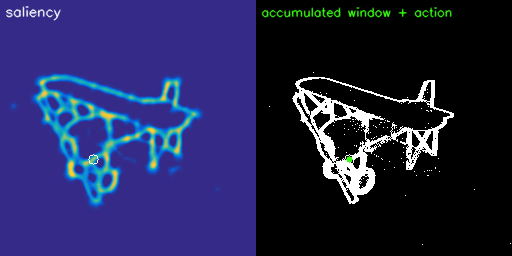
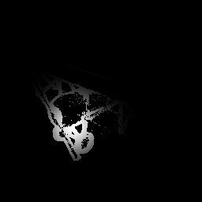

# ActiveVision

Bio-inspired active vision tutorial for generating event-based sensorimotor sequences from 3D objects.

This repository implements a compact offline pipeline for studying object perception through active vision. The goal is to transform a static 3D object into a temporally structured visual experience by simulating small fixational camera movements, converting the resulting RGB sequence into events, and extracting salient regions of interest through a proto-object attention mechanism.

The pipeline is motivated by active vision and sensorimotor contingency theory. Instead of treating object recognition as a passive classification problem over static images, the tutorial builds a sequence of visual samples generated by controlled camera motion. These samples are then converted into event-based representations and processed with an attention module that selects informative regions over time.

<p align="center">
  <table>
    <tr>
      <td align="center">
        <b>Neuormodulated proto-object attention</b><br>
        
      </td>
      <td align="center">
        <b>Foveated views</b><br>
        
      </td>
    </tr>
  </table>
</p>
## Pipeline

The tutorial follows five steps.

1. **Load and render a 3D object**

   A `.blend` object is imported into a simple Blender scene. The object is centred, scaled, illuminated, and viewed by a camera fixating the object.

2. **Simulate drift-like fixational eye movements**

   The camera undergoes small accumulated pan and tilt perturbations. In biological vision, fixational eye movements include drift, tremor, and microsaccades. In this tutorial we implement only a drift-like component, modelled as a Gaussian random walk in the camera's local pan and tilt axes.

   The current implementation does not include discrete microsaccadic jumps or tremor.

3. **Convert RGB frames into events**

   The rendered RGB sequence is passed through the IEBCS event camera simulator. This produces an event stream encoding temporal luminance changes caused by the small camera movements.

4. **Compute neurmodulated proto-object attention**

   Events are accumulated over short temporal windows. Each event frame is processed with a multiscale centre-surround saliency operator. The resulting saliency map is converted into a probability distribution using a temperature-weighted (neuromodulated) softmax:

```math
   p(x,y) = \frac{\exp(\beta S(x,y))}{\sum_{x',y'} \exp(\beta S(x',y'))}
```

   where $`S(x,y)`$ is the normalised saliency map and $`\beta`$ is an inverse-temperature parameter. Larger $`\beta`$ values produce sharper, more deterministic attentional selections. Smaller $`\beta`$ values produce more exploratory sampling.

5. **Extract ROIs and saccadic displacements**

   The sampled attentional locations define regions of interest. Consecutive attention shifts define a saccadic trajectory:

```math
   s_t = (\Delta x_t, \Delta y_t)
```

   These trajectories provide a compact sensorimotor description of how the system explores the object.

6. **Build event-based sensorimotor learning pairs**

   The foveated ROIs are paired with the corresponding saccadic displacements. This creates a sequence of local visual samples and motor actions that can be used for downstream sensorimotor learning. In this way, the static object is transformed into an active event-based experience, where each foveation is linked to the movement that generated the next visual sample.

## Repository structure

```text
activeVision/
├── nb_activeVision_tutorial.ipynb
├── nb_attention_neuromodulation_tutorial.ipynb
├── data/
│   ├── airplane_010.blend
│   ├── foveations.gif
│   ├── saliency_window_action.gif
│   └── renders/
├── figures/
├── src/
│   ├── analysis_helpers.py
│   ├── scene/
│   │   ├── blender_scene.py
│   │   ├── camera_motion.py
│   │   └── render_offline.py
│   ├── IEBCS/
│   │   └── event camera simulation code
│   └── attention/
│       ├── attention.py
│       └── foveation.py
└── README.md
```

## Requirements
The tutorial assumes that Blender's Python API, `bpy`, is available inside the active Python environment. Typical dependencies include:
```text
bpy
numpy
opencv-python
matplotlib
imageio
Pillow
```

# Citation
If you use this tutorial, please cite the associated workshop abstract: 

**Rodriguez-Garcia, A.**, Ghosh, A., Ramaswamy, S., & D'Angelo, G. (2025). *Object perception through visual attention*. Zenodo. https://doi.org/10.5281/zenodo.15802809


<small>
Object assets are sourced from <b>Toys4K</b> (Stojanov, Thai, & Rehg, 2021), whose assets are distributed under different Creative Commons licenses. Users should consult the original dataset resources for asset-specific attribution and licensing requirements: https://rehg.org/publication/dataset2/
</small>